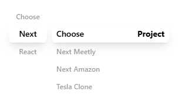
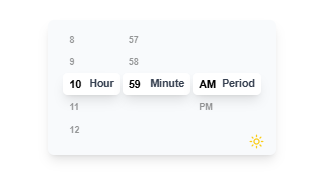
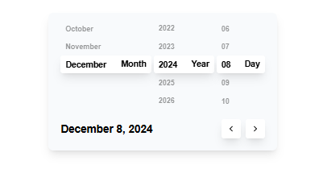
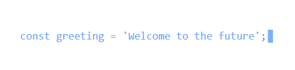
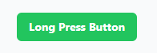
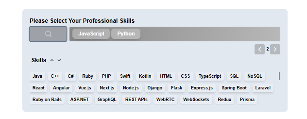
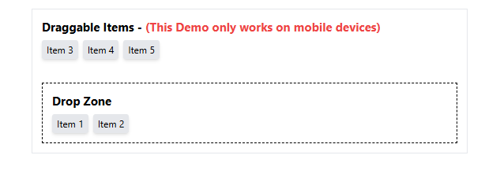

# Link UI

A versatile and customizable collection of UI components to speed up your development workflow. Designed with flexibility and scalability in mind, these components integrate seamlessly with modern frameworks like React.Js and Next.Js.

## Installation

To set up the project and install the necessary dependencies, follow these steps:

### Prerequisites

Make sure you have the following installed:

- [Node.js](https://nodejs.org/) (v18 or higher recommended)
- [npm](https://www.npmjs.com/) or [yarn](https://yarnpkg.com/) or [pnpm](https://pnpm.io/)

### Install the Package

Install the main library along with its peer dependencies:

```bash
npm install @jawad_ammar/link-ui react react-dom tailwindcss clsx
Or
yarn add @jawad_ammar/link-ui react react-dom tailwindcss clsx
Or
pnpm add @jawad_ammar/link-ui react react-dom tailwindcss clsx
```

---

Here is an overview of the available components in this library with their usage.

# 1. Picker Component

The `Picker` component is an interactive scrolling picker designed for selecting values like dates, numbers, or other options. It supports customizable settings, sound effects, and responsive design.



## Features

- **Smooth Scrolling**: Scroll through items with customizable velocity.
- **Sound Effects**: Play sound on interaction (`pop` or `click`).
- **Customizable Appearance**: TailwindCSS class support for all components.
- **Observer-based Selection**: Uses IntersectionObserver for determining the active item.
- **Initial Value**: Set a predefined starting point for the picker.
- **Multiple Options**: Accepts an array of options (`strings` or `numbers`) for display.

## Props

|      Prop Name       |                          Type                          | Required |       Default       |                                                                                                                              Description                                                                                                                              |
| :------------------: | :----------------------------------------------------: | :------: | :-----------------: | :-------------------------------------------------------------------------------------------------------------------------------------------------------------------------------------------------------------------------------------------------------------------: |
|    `visibleItems`    |                        `number`                        |   Yes    |         N/A         |                                                                                                              The number of items visible in the picker.                                                                                                               |
|   `scrollVelocity`   |          `0.5 \|  1 \| 1.5 \| 2 \| 2.5 \| 3`           |    No    |         `2`         |                                                                                            The velocity of scrolling, determined by predefined numeric values (0.5 to 3).                                                                                             |
|   `onValueChange`    | `(value: String \| Number \| Boolean \| null) => void` |   Yes    |         N/A         |                                                                                                     Callback function triggered when the selected value changes.                                                                                                      |
|     `labelText`      |                    `string \| null`                    |    No    |       `null`        |                                                                                                                  Optional text label for the picker.                                                                                                                  |
|   `componentWidth`   |                        `number`                        |   Yes    |         N/A         |                                                                                                             The width of the picker component in pixels.                                                                                                              |
|    `soundEffect`     |                   `"pop" \| "click"`                   |    No    |        `pop`        |                                                                                                    Optional sound effect to play when interacting with the picker.                                                                                                    |
|    `initialValue`    |                    `number \| null`                    |    No    |       `null`        | Optional initial value of the picker, can be null. If null, the picker will start at the top of the list. The initial value is the index of the selected item. Note: The initial value is 1-indexed, so if the first item is selected, the initial value should be 1. |
| `containerClassName` |                      `ClassValue`                      |    No    |        `""`         |                                                                                                   Optional TailwindCSS class name for the container of the picker.                                                                                                    |
|   `labelClassName`   |                      `ClassValue`                      |    No    |        `""`         |                                                                                                     Optional TailwindCSS class name for the label of the picker.                                                                                                      |
|      `options`       |                 `string[] \| number[]`                 |   Yes    |         N/A         |                                                                                                      Array of options available for selection within the picker.                                                                                                      |
|  `initialItemLabel`  |        `string \| number \|  boolean \|  null`         |    No    | `null - options[0]` |                 Optional initial label for the selected item, can be any type or null. If null, the picker will take the first item in the options array as the initial label. Else, the picker will take the initialItemLabel as the initial label.                  |
|   `itemClassName`    |                      `ClassValue`                      |    No    |        `""`         |                                                                                               Optional TailwindCSS class name for the selectable options in the picker.                                                                                               |
|      `isMuted`       |                       `boolean`                        |    No    |       `true`        |                                                                                                                Optional boolean to mute sound effects.                                                                                                                |
| `ObserverClassName`  |                      `ClassValue`                      |    No    |        `""`         |                                                                                                    Optional TailwindCSS class name for the observer of the picker.                                                                                                    |

---

## Example Usage

```tsx
import { Picker } from "@jawad_ammar/link-ui";

<Picker
  visibleItems={3}
  scrollVelocity={1.5}
  onValueChange={(value) => console.log("Selected value:", value)}
  componentWidth={300}
  options={["Option 1", "Option 2", "Option 3", "Option 4"]}
  initialValue={2}
  labelText="Select an option"
  soundEffect="pop"
  isMuted={false}
  containerClassName="my-container-class"
  labelClassName="my-label-class"
  itemClassName="my-item-class"
  ObserverClassName="my-observer-class"
/>;
```

# 2. Time Picker Component

The `TimePicker` component is a customizable time selection interface built with React. It includes hour, minute, and period pickers, and adapts its theme and styling based on the provided properties. Additionally, it determines whether the selected time corresponds to day or night based on the user's geolocation.



## Features

- The theme prop toggles between `light` and `dark` modes.
- Uses geolocation and sunrise/sunset times to determine whether the selected time is during the `day` or `night`.
- Allows users to select `hours`, `minutes`, and `AM/PM` periods.
- Built with Next, React and TailwindCSS.

## props

|   Prop Name    |           Type           | Required | Default |                                       Description                                       |
| :------------: | :----------------------: | :------: | :-----: | :-------------------------------------------------------------------------------------: |
|    `theme`     |   `"light" \| "dark"`    |    No    | "light" |                            Sets the theme for the component.                            |
| `onTimeChange` | `(time: string) => void` |   Yes    |   N/A   | Callback function triggered when the time changes, returning the formatted time string. |
|  `className`   | `classValue (from clsx)` |    No    |   N/A   |                  Additional TailwindCSS class to style the component.                   |

## Example Usage

```tsx
import { TimePicker } from "@jawad_ammar/link-ui";

<TimePicker
  theme="dark"
  onTimeChange={(time) => console.log("Selected time:", time)}
  className="my-time-picker-class"
/>;
```

# 3. Date Picker Component



The `DatePicker` component is a React-based date selection tool that allows users to pick a day, month, and year. It includes customizable themes and provides real-time updates of the selected date in a user-friendly format.

## Features

- The theme prop toggles between `light` and `dark` modes.
- Users can select the `day`, `month`, and `year` using intuitive pickers.
- Quickly navigate through months using previous and next buttons.
- Outputs the selected date in a localized string format.
- Built with Next, React and TailwindCSS.

## props

|   Prop Name    |                     Type                      | Required | Default |                                              Description                                               |
| :------------: | :-------------------------------------------: | :------: | :-----: | :----------------------------------------------------------------------------------------------------: |
|    `theme`     |              `"light" \| "dark"`              |    No    | "light" |                                   Sets the theme for the component.                                    |
| `onDateChange` | `(date: Date, formattedDate: string) => void` |   Yes    |   N/A   | Callback function triggered when the date changes, returning the Date object and its localized string. |
|  `className`   |           `classValue (from clsx)`            |    No    |   N/A   |                          Additional TailwindCSS class to style the component.                          |

## Example Usage

```tsx
import { DatePicker } from "@jawad_ammar/link-ui";

<DatePicker
  theme="dark"
  onDateChange={(date, formattedDate) =>
    console.log("Selected date:", date, "Formatted date:", formattedDate)
  }
  className="my-date-picker-class"
/>;
```

# 4. Type Writer Component

The `TypeWriter` component provides an animated typing effect for text, complete with optional looping functionality and customizable styles for both the text and cursor.



## Features

- **Typing Animation**: Simulates typing and deleting text.
- **Looping**: Optionally loops the animation for infinite playback.
- **Custom Styles**: TailwindCSS support for both text and cursor styling.
- **Configurable Speed**: Set the animation duration for the typing effect.

## props

|      Prop Name      |     Type     | Required |  Default  |                        Description                         |
| :-----------------: | :----------: | :------: | :-------: | :--------------------------------------------------------: |
|       `text`        |   `string`   |   Yes    |    N/A    |      The text to display with the typewriter effect.       |
|       `loop`        |  `boolean`   |    No    |   false   |             If true, the animation will loop.              |
| `animationDuration` |   `number`   |    No    | `100`(ms) | Duration of the animation (typing effect) in milliseconds. |
|    `cursorStyle`    | `ClassValue` |    No    |  `null`   |         TailwindCSS class for the cursor styling.          |
|     `textStyle`     | `ClassValue` |    No    |  `null`   |          TailwindCSS class for the text styling.           |

## Example Usage

```tsx
import { TypeWriter } from "@jawad_ammar/link-ui";
<TypeWriter
  text="Hello, World!"
  loop={true}
  animationDuration={200}
  cursorStyle="text-gray-500"
  textStyle="text-gray-900"
/>;
```

# 5. Long Press Button Component

The `LongPressButton` component is a versatile button that triggers a callback function when pressed or held down. It supports single-click and long-press interactions, making it suitable for various use cases.



## Features

- **Single and Long Press**: Executes different logic for a single press or continuous press.
- **Customizable Delay**: Adjust the delay between repeated actions during long presses.
- **TailwindCSS Styling**: Easily style the button with TailwindCSS classes.
- **Arguments Support**: Pass custom arguments to the callback function.
- **Disabled State**: Disable the button to prevent interactions.

## props

|     Prop Name     |                              Type                               | Required |  Default  |                                              Description                                               |
| :---------------: | :-------------------------------------------------------------: | :------: | :-------: | :----------------------------------------------------------------------------------------------------: |
|     `onPress`     | `(counter: number, isHolding: boolean, ...args: TArgs) => void` |   Yes    |    N/A    |                        Function to execute when the button is pressed or held.                         |
|    `className`    |                          `classValue`                           |   Yes    |   null    |                       TailwindCSS classes for customizing the button appearance.                       |
| `timeOutDuration` |                            `number`                             |    No    | `200`(ms) |               Time (in milliseconds) before the button starts responding to long press.                |
|   `onPressArgs`   |               `(`String \| Number \| Boolean`)[]`               |    No    |    N\A    | Arguments passed to the `onPress` function. It can be an array of strings, numbers, or boolean values. |
|    `disabled`     |                            `boolean`                            |    No    |  `false`  |                 If true, the button will be disabled and will not trigger any actions.                 |
|      `delay`      |                            `number`                             |    No    | `10`(ms)  |                    Delay between each action during a long press (in milliseconds).                    |

## Example Usage

```tsx
import { LongPressButton } from "@jawad_ammar/link-ui";

<LongPressButton
  onPress={(counter, isHolding, arg1, arg2) => {
    console.log("Button pressed", counter, isHolding, arg1, arg2);
  }}
  className="my-button-class"
  timeOutDuration={500}
  onPressArgs={["arg1", 2, true]}
  disabled={false}
  delay={50}
>
  Press or Hold
</LongPressButton>;
```

# 6. Drop Input Component

The `DropInput` component is a versatile input box that allows users to drag and drop items or filter and select items from a list. It features a customizable design with two themes (Light and Dark), drag-and-drop functionality, and options for filtering items. This component is suitable for scenarios where users need to choose multiple items from a list and manage them in an interactive manner.



## Features

- **Filterable List**: Allows users to filter the list of options by typing in the input field.
- **Drag and Drop**: Users can drag items from the list and drop them into a selected zone.
- **Item Deletion**: Dropped items can be deleted from the selected zone.
- **Scroll Functionality**: Supports smooth scrolling for both the list and the drop zone.
- **Customizable Theme**: Choose between "Dark" or "Light" themes.
- **Responsiveness**: The component is responsive and works well on different screen sizes.

## Props

|        Prop        |            Type             | Required | Default  |                          Description                          |
| :----------------: | :-------------------------: | :------: | :------: | :-----------------------------------------------------------: |
|      `theme`       |     `"Dark" \| "Light"`     |    No    | `"Dark"` |                    Theme of the component.                    |
|   `optionsLabel`   |          `string`           |    No    |    -     |                  Label for the options list.                  |
|      `label`       |          `string`           |    No    |    -     |                  Label for the input field.                   |
|    `className`     |        `ClassValue`         |    No    |    -     | TailwindCSS class for customizing the component's appearance. |
| `optionsClassName` |          `string`           |    No    |    -     |  TailwindCSS class for customizing the options' appearance.   |
|     `options`      |         `string[]`          |   Yes    |    -     |         Array of options to display in the component.         |
| `defaultSelected`  |         `string[]`          |    No    |   `[]`   |                   Default selected options.                   |
|     `onChange`     | `(value: string[]) => void` |   Yes    |    -     | Callback function triggered when the selected options change. |

## Example Usage

```tsx
import { DropInput } from "@jawad_ammar/link-ui";

<DropInput
  onChange={(value) => console.log("Selected options:", value)}
  options={["Option1", "Option2", "Option3"]}
  defaultSelected={["Option1"]}
  theme="Light"
  label="Drag and drop the selected option"
  optionsLabel="List of options"
  className="w-4/5 md:w-3/5 lg:w-2/5"
  optionsClassName="max-h-[90px]"
/>;
```

# 7. `useNativeDrop` Hook

The `useNativeDrop` hook provides functionality to implement drag-and-drop features on mobile devices, including touch support, for a set of draggable items and a designated drop zone. It supports pre-selected items, dynamic updates, and smooth touch interactions.



## Features

- **Drag-and-Drop Support**: Seamlessly drag items into a drop zone.
- **Touch Support**: Optimized for touch devices with smooth interactions.
- **Dynamic Updates**: Automatically updates draggable and dropped items.
- **Customizable**: Initialize with default selected items.

## Props

|       Prop        |    Type    | Required | Default |                                   Description                                   |
| :---------------: | :--------: | :------: | :-----: | :-----------------------------------------------------------------------------: |
| `draggableItems`  | `string[]` |   Yes    |    -    |      Array of items that can be dragged and dropped within the drop zone.       |
| `defaultSelected` | `string[]` |    No    |  `[]`   | Array of items pre-selected in the drop zone when the component is initialized. |

## Returns

The `useNativeDrop` hook provides the following values:

### Handlers

|           Name            |           Type           |                                 Description                                  |
| :-----------------------: | :----------------------: | :--------------------------------------------------------------------------: |
|    `handleTouchStart`     |  `(event, id) => void`   |                    Starts the drag operation for an item.                    |
|     `handleTouchMove`     |    `(event) => void`     | Moves the dragged item across the screen, updating its position dynamically. |
|     `handleTouchEnd`      |       `() => void`       | Ends the drag operation and drops the item into the drop zone if applicable. |
| `handleDroppedItemDelete` | `(item: string) => void` | Removes an item from the drop zone and adds it back to the draggable items.  |

### `State`

|       Name       | Type       |                       Description                        |
| :--------------: | :--------- | :------------------------------------------------------: |
| `draggableItems` | `string[]` | Dynamic list of draggable items available for selection. |
|  `droppedItems`  | `string[]` |    Dynamic list of items dropped into the drop zone.     |

### `Ref's`

|      Name      |            Type             |                                 Description                                  |
| :------------: | :-------------------------: | :--------------------------------------------------------------------------: |
| `containerRef` | `React.Ref<HTMLDivElement>` | Ref for the container element wrapping the draggable and drop zone elements. |
| `dropZoneRef`  | `React.Ref<HTMLDivElement>` |          Ref for the drop zone element where items can be dropped.           |

## Example Usage

```tsx
"use client";
import React from "react";
import { useNativeDrop } from "@jawad_ammar/link-ui";

function App() {
  const items = ["Item 1", "Item 2", "Item 3", "Item 4"];
  const {
    handleTouchStart,
    handleTouchMove,
    handleTouchEnd,
    handleDroppedItemDelete,
    draggableItems,
    droppedItems,
    dropZoneRef,
    containerRef,
  } = useNativeDrop({ draggableItems: items, defaultSelected: ["Item 1"] });

  return (
    <div ref={containerRef} className="flex flex-col space-y-4 p-4">
      <div>
        <h2>Draggable Items</h2>
        <div className="flex space-x-2">
          {draggableItems.map((item, index) => (
            <div
              key={item}
              onTouchStart={(e) => handleTouchStart(e, index)}
              onTouchMove={handleTouchMove}
              onTouchEnd={handleTouchEnd}
              className="py-1 px-3 bg-blue-500 text-white rounded cursor-pointer"
            >
              {item}
            </div>
          ))}
        </div>
      </div>
      <div>
        <h2>Drop Zone</h2>
        <div
          ref={dropZoneRef}
          className="border-2 border-dashed border-gray-400 h-32 flex flex-wrap p-2"
        >
          {droppedItems.map((item) => (
            <div
              key={item}
              onClick={() => handleDroppedItemDelete(item)}
              className="py-1 px-3 bg-green-500 text-white rounded cursor-pointer m-1"
            >
              {item}
            </div>
          ))}
        </div>
      </div>
    </div>
  );
}

export default App;
```

## 8. `useScroll` Hook

The `useScroll` hook enables smooth and customizable scrolling behavior for a scrollable container. It supports both mouse and touch-based interactions, as well as customized scroll velocity for finer control.

## Features

- **Custom Scroll Velocity**: Adjust the scrolling speed using a configurable `velocity` prop.
- **Drag-to-Scroll Support**: Enable smooth scrolling using mouse or touch drag gestures.
- **Wheel Event Handling**: Smoothly handle mouse wheel scroll events with a slowdown effect.
- **Touch Support**: Optimized for mobile touch interactions.

---

## Props

### `UseScrollProps`

| Prop       | Type                               | Required | Default | Description                                               |
| ---------- | ---------------------------------- | -------- | ------- | --------------------------------------------------------- |
| `velocity` | `0.5 \| 1 \| 1.5 \| 2 \| 2.5 \| 3` | Yes      | -       | The scrolling speed as a numeric value between 0.5 and 3. |

---

## Returns

The `useScroll` hook provides the following values:

### `Ref's`

| Name  | Type                        | Description                                            |
| ----- | --------------------------- | ------------------------------------------------------ |
| `ref` | `React.Ref<HTMLDivElement>` | A `ref` to attach to the scrollable container element. |

---

## Example Usage

```tsx
"use client";
import React from "react";
import { useScroll } from "@jawad_ammar/link-ui";

function App() {
  const { ref } = useScroll({ velocity: 2 });

  return (
    <div
      ref={ref}
      style={{
        height: "300px",
        width: "100%",
        overflowY: "auto",
        border: "1px solid #ccc",
        cursor: "grab",
      }}
    >
      <div style={{ height: "1000px", padding: "16px" }}>
        <p>Scrollable Content</p>
        <p>Keep scrolling...</p>
        <p>This content is very long!</p>
      </div>
    </div>
  );
}

export default App;
```

## 9. `IDock` Component

The **IDock** component is a customizable, animated dock component for React applications. It allows you to place interactive items in a dock-like UI at various screen positions, with support for scaling animations and tooltips.

## Features

- **Customizable Positions**: Place the dock at any of the six predefined positions on the screen.
- **Smooth Animations**: Configure animation duration for hover effects.
- **Interactive Tooltips**: Display tooltips on hover with customizable styles.
- **Flexible Design**: Add custom styles to both the dock and its items.


## Props

| Prop                | Type                                                                                              | Default         | Required | Description                                                               |
| ------------------- | ------------------------------------------------------------------------------------------------- | --------------- | -------- | ------------------------------------------------------------------------- |
| `position`          | `"Top-Left" \| "Top-Right" \| "Bottom-Left" \| "Bottom-Right" \| "Top-Center" \| "Bottom-Center"` | `Bottom-Center` | Optional | Position of the dock on the screen.                                       |
| `className`         | `ClassValue`                                                                                      | `undefined`     | Optional | Custom classes for the dock container.                                    |
| `animationDuration` | `75 \| 100 \| 150 \| 200 \| 300 \| 500 \| 700 \| 1000`                                            | `300`           | Optional | Animation duration in milliseconds for hover effects and transformations. |

### `IDock.Child`

| Prop               | Type                  | Required | Description                                                 |
| ------------------ | --------------------- | -------- | ----------------------------------------------------------- |
| `icon`             | `React.ReactNode`     | Required | Icon or content to display inside the dock item.            |
| `className`        | `ClassValue`          | Optional | Custom classes for the dock item.                           |
| `tooltip`          | `string \| undefined` | Optional | Text to display as a tooltip when the dock item is hovered. |
| `tooltipClassName` | `ClassValue`          | Optional | Custom classes for the tooltip.                             |
| `onClick`          | `() => void`          | Optional | Callback function to execute when the dock item is clicked. |

## Example Usage

```tsx
import { IDock } from "@jawad_ammar/link-ui";

const App = () => {
  return (
    <IDock position="Bottom-Center">
      <IDock.Child
        icon={
          <span role="img" aria-label="home">
            🏠
          </span>
        }
        tooltip="Home"
        onClick={() => alert("Home clicked")}
      />
      <IDock.Child
        icon={
          <span role="img" aria-label="search">
            🔍
          </span>
        }
        tooltip="Search"
        onClick={() => alert("Search clicked")}
      />
      <IDock.Child
        icon={
          <span role="img" aria-label="settings">
            ⚙️
          </span>
        }
        tooltip="Settings"
        onClick={() => alert("Settings clicked")}
      />
    </IDock>
  );
};

export default App;
```
